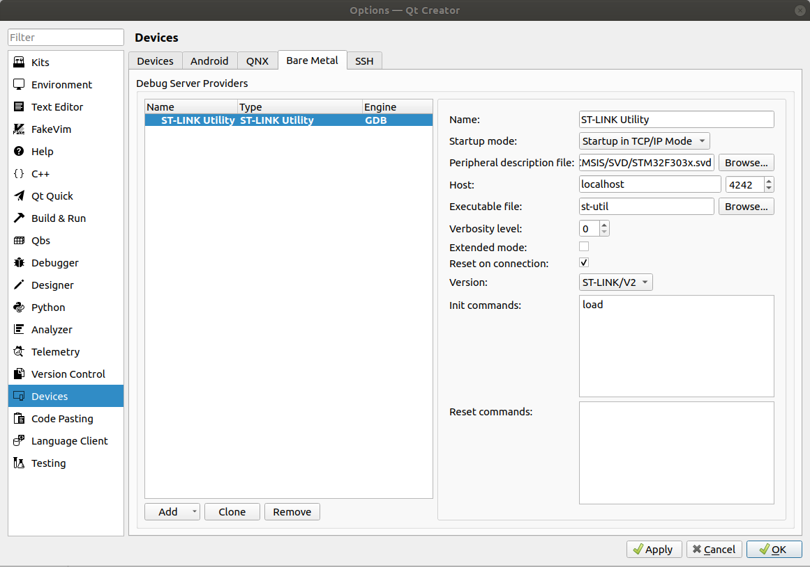
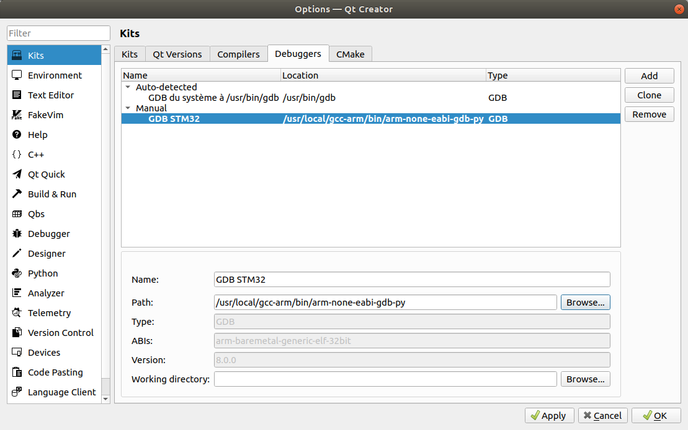
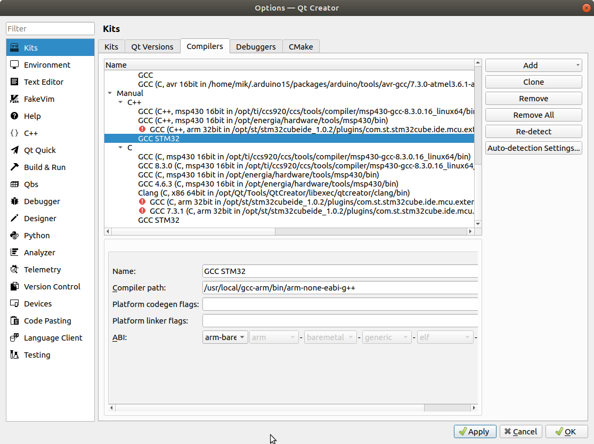
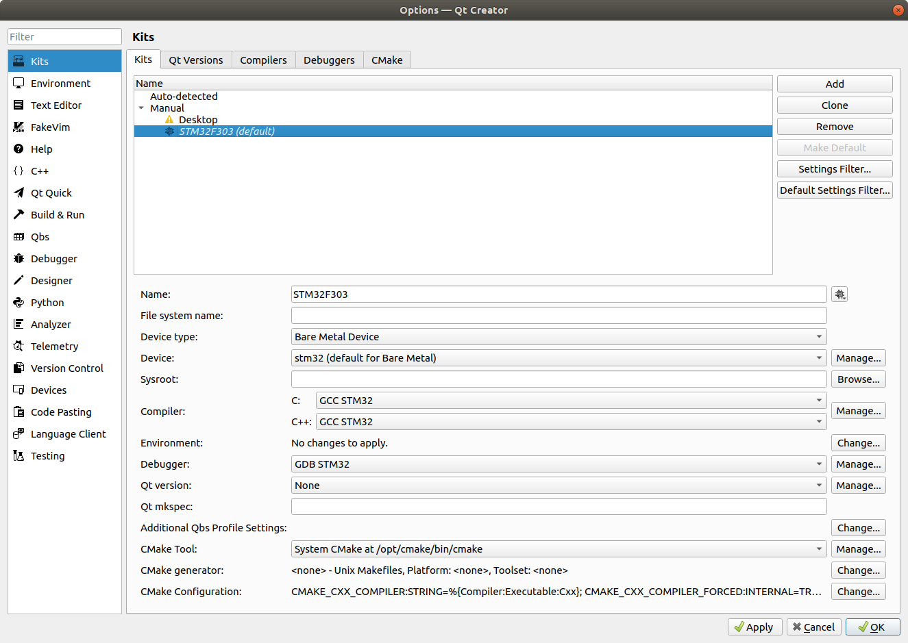
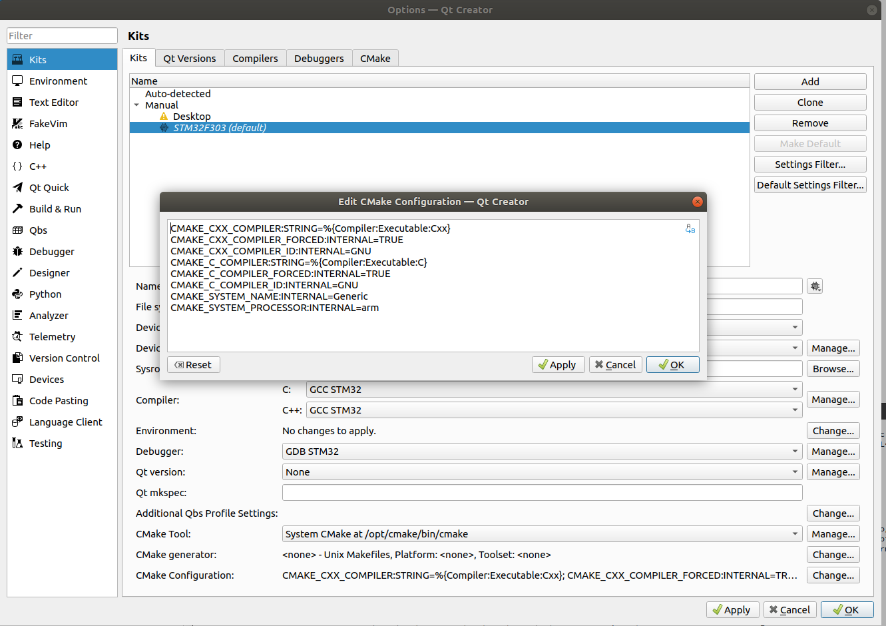
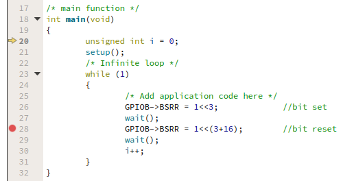
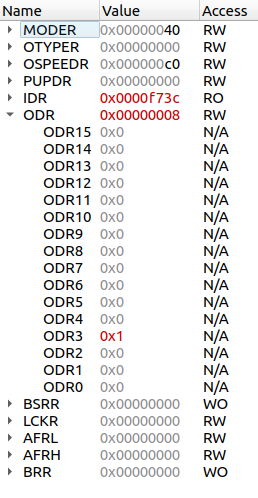

# STM32 Debug with QtCreator

QtCreator is a cross-platform integrated development environment (IDE) that can be configured for the STM32. It embeds:
* a source editor
* a build system
* an easy-to-use graphical debugger interface

We focus here on how to use the debugger (instead of the command line gdb).

Tested with QtCreator 4.13.2. GCC for ARM should be installed first (compiler)

## Installation

 * install [QtCreator](https://www.qt.io/development-tools)
 * check for the BareMetal plugin in Help->About plugins… (on Mac:`Qt Creator->About Plugins…`), and Device Support->BareMetal 

## Configuration

Qt Creator should be configured in 2 sections`tools->options` (on Mac: `Qt Creator->Preferences…`):

* the `Devices` part
* the `Kits` part

### Devices

Define the Device (how to connect to the device), in the `Devices` part:

 In the tab `Bare Metal`, click `add->ST-LINK utility`:

 

 There is a `peripheraldescription file` edit line. You can give the file `sys/CMSIS/SVD/STM32F303x.svd`. The SVD file give the information on the register set of the MCU, so that we can inspect the full configuration of the target chip during debug (peripheral view)

 Don't forget to click on `Apply` button!

 With Macs in `D102`, the full path is: `/opt/stlink/bin/st-util`

 Then, in the `Devices` tab, click `add…` and add a bare-metal device that uses st-link:

 

### Kits

In the `Kits` part:

  * First define the debugger `Debugger` tab:

 

 To know where is your gdb version, you can simply type in a terminal:
 ```sh
 which arm-none-eabi-gdb
 ```
 With Macs in `D102`, the fullepath is: `/opt/gcc-arm/bin/arm-none-eabi-gdb-py`

 QtCreator requires to use a gdb version that embeddeds the python extension. it is the `arm-none-eabi-gdb-py` version in the GCC version provided by ARM.

 * You can set the cross-compiler (This is not required if you wants to debug only). Here, I have both set the C compiler (`gcc`) and the c++ compiler (`g++`). It is exactly the same configuration, just rename the compiler path from gcc to g++:

 

 * The we can define the `kit` that contains all the stuff (device/debugger) in `Kits` section:

 

 There is a warning in the Kit configuration if no compiler is associated. By default, `cmake` will try to compile on the host. To configure it as a cross compiler, We have to change the `CMake configuration` in the kit:

 

~~~~
CMAKE_CXX_COMPILER:STRING=%{Compiler:Executable:Cxx}
CMAKE_CXX_COMPILER_FORCED:INTERNAL=TRUE
CMAKE_CXX_COMPILER_ID:INTERNAL=GNU
CMAKE_C_COMPILER:STRING=%{Compiler:Executable:C}
CMAKE_C_COMPILER_FORCED:INTERNAL=TRUE
CMAKE_C_COMPILER_ID:INTERNAL=GNU
CMAKE_SYSTEM_NAME:INTERNAL=Generic
CMAKE_SYSTEM_PROCESSOR:INTERNAL=arm
~~~~

## Debugging session

### Debug session start

To start a debugging session, the binary `.elf` should be generated. Then start the debugger using: `Debug->Start and break on main`.

It should launch `st-util`, the tool that communicates between the board and qtCreator.

### Using debug session

Qt Creator acts only as a graphical user interface, and all the `gdb` commands are available using the GUI:

In the image just below:
 * the yellow arrow shows the next instruction that will be executed
 * the red dot is a `breakpoint`, where the program should stop. It is inserted/removed by a simple click just before the line number.



The program execution is controlled by the commands  (A tip label is displayed when the mouse gets over the buttons):
 * start/stop/resume commands
 * `step over` won't enter in a function, but execute it directly
 * `step into` will enter in a function so that it can be debugged

With the SVD file provided in the `Device` configuration, we can have a look at the peripheral state (in read-only mode at this date), using `window->views->Peripheral Registers`. Then, a right click on the peripheral register window to choose the peripheral to display. In the following capture, the GPIOB peripheral is displayed, and since the last breakpoint, the bit 3 of `ODR` has been updated (shown in red):


